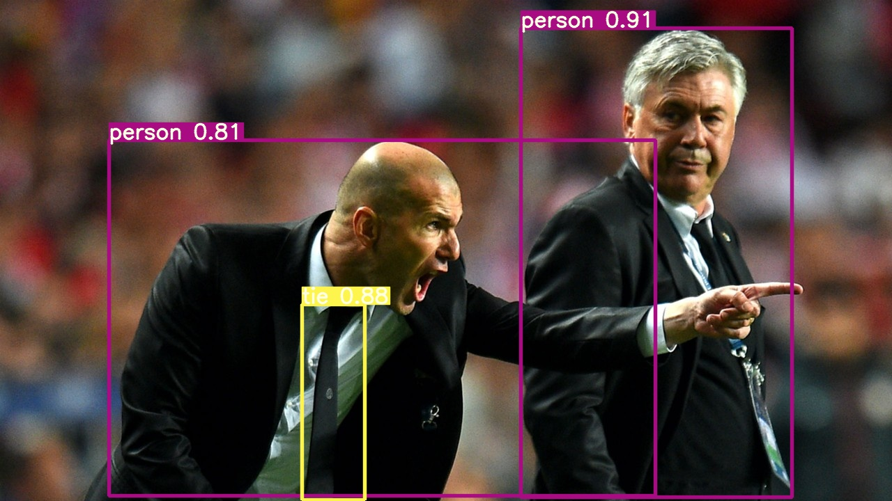

# Apply Python YoloV5

<h2>Optimized code to apply YoloV5 on Python</h2>

These codes are inspiring and editing from regional yolov5 example code (https://github.com/ultralytics/yolov5.git) 

One of the yolov5 dependency is Pytorch and it might not able to be installed by using PIP

To know which way is best for you, you should go to (https://pytorch.org/) to found out.
